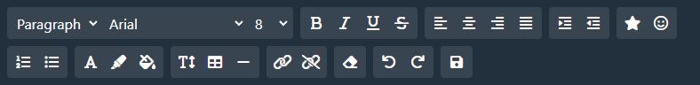
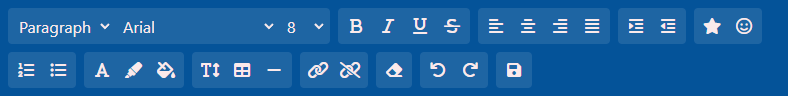
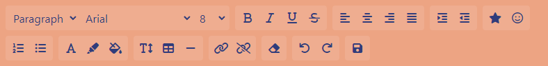
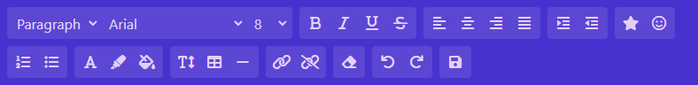
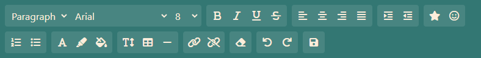
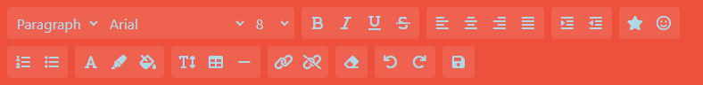
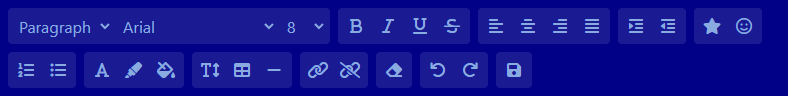
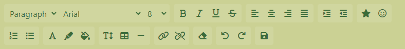
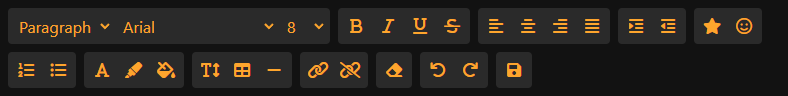
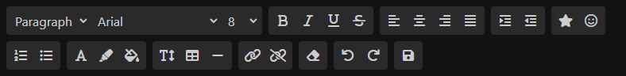

# EZ Toolbar Plugin

The EZ Toolbar is a customizable and extensible JavaScript plugin for adding a a text editing toolbar to your web application. The plugin itself contains no built in ability to alter text, however it provides an easy way to attach your own JavaScript functionality to each component of the toolbar.

## Table of Contents

- [Introduction](#introduction)
- [Installation](#installation)
- [Usage](#usage)
- [Options](#options)
- [Custom Buttons](#custom-buttons)
- [Customization](#customization)
- [Themes](#themes)
- [API Reference](#api-reference)

## Introduction

The EZ Toolbar Plugin provides a flexible way to add a feature-rich toolbar to your web application. With this plugin, you can easily create and customize toolbars for text editing elements, allowing users to format text, change font styles, and perform various editing tasks with ease.

## Installation

To get started with the EZ Toolbar Plugin, you need to include the following in the <HEAD> section of your HTML:

```html
<!-- Point this to the location of the EZ Toolbar CSS file -->
<link href="css/ez-toolbar.css.css" rel="stylesheet" />
<!-- Point this to the location of the EZ Toolbar JavaScript file -->
<script src="js/ez-toolbar.js"></script>
```

These plugin requires both TailWind and Font Awesome. Add the following to your <HEAD> section to include them:

```html
<link
  href="https://cdn.jsdelivr.net/npm/tailwindcss@2.2.16/dist/tailwind.min.css"
  rel="stylesheet"
/>
<link
  href="https://cdnjs.cloudflare.com/ajax/libs/font-awesome/6.0.0-beta3/css/all.min.css"
  rel="stylesheet"
/>
```

## Usage

To create a toolbar, call the ezToolbar function and pass the query selector for the HTML element to which you want to attach the toolbar:

```javascript
ezToolbar("#myTextarea");
```

## Options

You can customize the toolbar by passing in various options. These are the options available: All options are optional.

- `fontStyles`: An array of style options. This will replace the default styles.
- `fontFamilies`: An array of font names. Specified fonts will be added in addition to the default ones.
- `fontSizes`: An array of font size options. This will replace the default options.
- `showSaveButton`: A boolean to show/hide the Save button.
- `customButtons`: An array of custom button objects.
  - `id`: a unique ID for the button _(Required)_
  - `faClass`: The FontAwesome class. _(Required)_ See: https://fontawesome.com/icons
  - `hoverText`: Text shown when you mouseover the button. Is also used for screen readers. _(Optional)_
- `themeName`: The name of a [predefined theme][#themes].
- `toolbarFontColor`: Custom font color for the toolbar. Overrides the theme.
- `toolbarBackgroundColor`: Custom background color for the toolbar. Overrides the theme.
- `sections`: An array of group names to display in the toolbar. if omitted, all sections will be displayed.

You can pass in the options using an object:

```javascript
const options = {
  fontStyles: ["Normal", "H1", "H2", "H3"],
  fontFamilies: ["Work Sans", "Source Sans Pro", "Montserrat", "PT Sans"],
  fontSizes: [10, 15, 20, 30, 40],
  showSaveButton: true,
  customButtons: [
    {
      id: "custom-button-1",
      faClass: "fas fa-star",
      hoverText: "Custom Button 1",
    },
    // Add more custom buttons here
  ],
  themeName: "Oceanic",
  toolbarFontColor: "#FFFFFF",
  toolbarBackgroundColor: "#00539C",
  sections: [
    "font-options", // Text Style, Font Family, Font Size
    "text-formatting", // Bold, Italic, Underline, Strikethrough
    "text-alignment", // Left Align, Center Align, Right Align,, Justified
    "text-indentation", // Increase Indent, Decrease Indent
    "special-characters", // Special Characters, Emoticons
    "list-options", // Numbered List, Bullet List
    "text-color-options", // Font Color, Hilight Color, Background Color
    "line-spacing", // Line Spacing, Table, Divider
    "link-options", // Add Hyperlink, Remove Hyperlink
    "formatting-options", // Clear Formatting
    "undo-redo", // Undo Changes, Redo Changes
  ],
};

ezToolbar("#myTextarea", options);
```

## Custom Buttons

You can add custom buttons to the toolbar by specifying the ` customButtons`` option. Each custom button should have an  `id`` , a Font Awesome class (`faClass ``), and optional hover text (`hoverText`). The hover text will also be used by screen readers if specified.

You can browse the available Font Awesome icons here: https://fontawesome.com/icons

```javascript
customButtons: [
    { id: 'custom-button-1', faClass: 'fas fa-star', hoverText: 'Custom Button 1' },
    { id: 'custom-button-2', faClass: 'fas fa-heart', hoverText: 'Custom Button 2' },
    // Add more custom buttons here
],

```

## Themes

There are 10 themes available, including the default theme. Apply a theme using the `themeName` [option][#options]. You can also manually set the toolbar background and font color - see [Options][#options].
| Theme Name| Preview |
| --------- | --- |
| **Default** |  |
| **Oceanic** |  |
| **Desert** |  |
| **Mystical** |  |
| **Harmonious**|  |
| **Flamingo** |  |
| **Marine** |  |
| **Verdant** |  |
| **Halloween** |  |
| **Dark** |  |

## API Reference

You can interact with the toolbar using JavaScript.

### Component IDs

| Component                | Component ID            | Hook (Function Name)     |
| ------------------------ | ----------------------- | ------------------------ |
| Font Style Dropdown      | `#ez-font-style`        | `ez_font_style(value)`   |
| Font Family Dropdown     | `#ez-font-family`       | `ez_font_family(value)`  |
| Font Size Dropdown       | `#ez-font-size`         | `ez_font_size(value)`    |
| Bold Button              | `#ez-bold`              | `ez_bold()`              |
| Italic Button            | `#ez-italic`            | `ez_italic()`            |
| Underline Button         | `#ez-underline`         | `ez_underline()`         |
| Strikethrough Button     | `#ez-strikethrough`     | `ez_strikethrough()`     |
| Align Left Button        | `#ez-align-left`        | `ez_align_left()`        |
| Align Center Button      | `#ez-align-center`      | `ez_align_center()`      |
| Align Right Button       | `#ez-align-right`       | `ez_align_right()`       |
| Align Justify Button     | `#ez-align-justify`     | `ez_align_justify()`     |
| Decrease Indent Button   | `#ez-decrease-indent`   | `ez_decrease_indent()`   |
| Increase Indent Button   | `#ez-increase-indent`   | `ez_increase_indent()`   |
| Special Character Button | `#ez-special-character` | `ez_special_character()` |
| Emoticons Button         | `#ez-emoticons`         | `ez_emoticons()`         |
| Numbered List Button     | `#ez-numbered-list`     | `ez_numbered_list()`     |
| Bullet List Button       | `#ez-bullet-list`       | `ez_bullet_list()`       |
| Font Color Button        | `#ez-font-color`        | `ez_font_color()`        |
| Highlight Color Button   | `#ez-highlight-color`   | `ez_highlight_color()`   |
| Background Color Button  | `#ez-background-color`  | `ez_background_color()`  |
| Line Spacing Dropdown    | `#ez-line-spacing`      | `ez_line_spacing()`      |
| Insert Table Button      | `#ez-insert-table`      | `ez_insert_table()`      |
| Insert Divider Button    | `#ez-insert-divider`    | `ez_insert_divider()`    |
| Insert Link Button       | `#ez-insert-link`       | `ez_insert_link()`       |
| Remove Link Button       | `#ez-remove-link`       | `ez_remove_link()`       |
| Clear Formatting Button  | `#ez-clear-formatting`  | `ez_clear_formatting()`  |
| Undo Button              | `#ez-undo`              | `ez_undo()`              |
| Redo Button              | `#ez-redo`              | `ez_redo()`              |
| Save Button              | `#ez-save`              | `ez_save()`              |

### Active Class

All buttons have an `active` class - setting this will show the button as pressed.

```javascript
let ezBoldBtn = document.getElementById("ez-bold");
ezBoldBtn.classList.toggle("active");
```

### Button Functions

All EZ Toolbar buttons call a JavaScript function whose name matches the ID of the clicked button. If the function does not exist, an error is logged to the developer console. All dashes "<kbd>-</kbd>" from the ID names will be swapped with underscores "<kbd>\_</kbd>".

Example:

```javascript
// Add or remove active status when "Bold" button (#ez-bold) is clicked
ez_bold = () => {
  document.getElementById("ez-bold").classList.toggle("active");
};
```

### Dropdown Functions

All EZ Toolbar dropdowns will call a JavaScript function whose name matches the ID of the dropdown whenever the selected option changes. The text of the selected option will be passed as a parameter of the function call. If the function does not exist, an error is logged to the developer console. All dashes "<kbd>-</kbd>" from the ID names will be swapped with underscores "<kbd>\_</kbd>".

Example:

```javascript
// Show an alert with the selected Font Family when "#ez-font-family" dropdown changes
ez_font_family = (fontFamily) => {
  alert(fontFamily);
};
```
